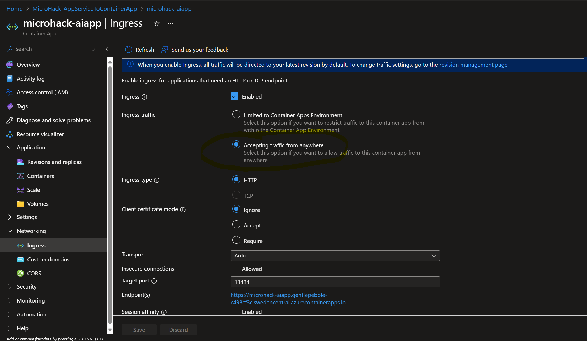
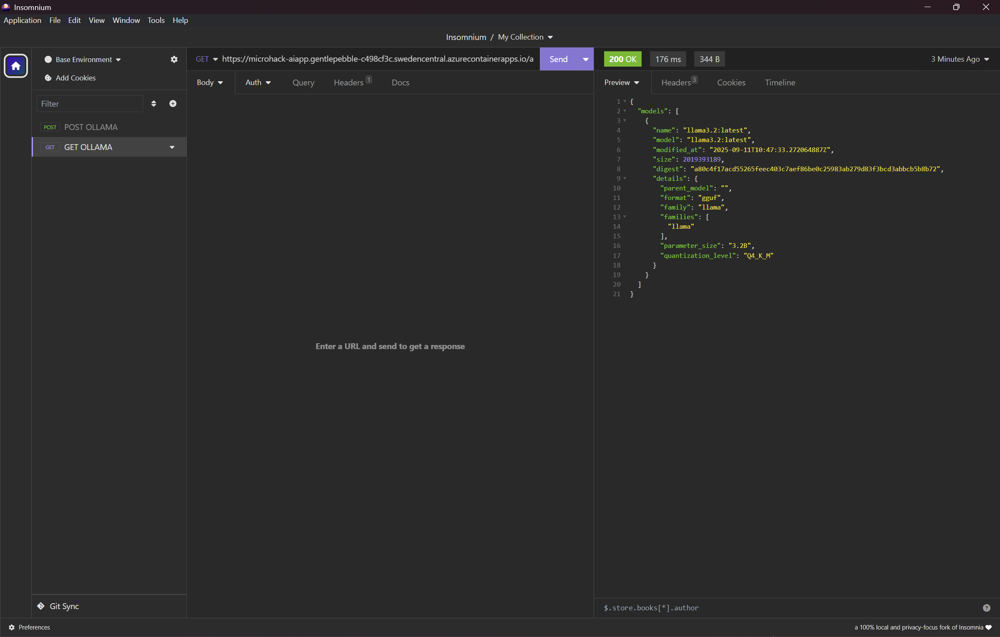
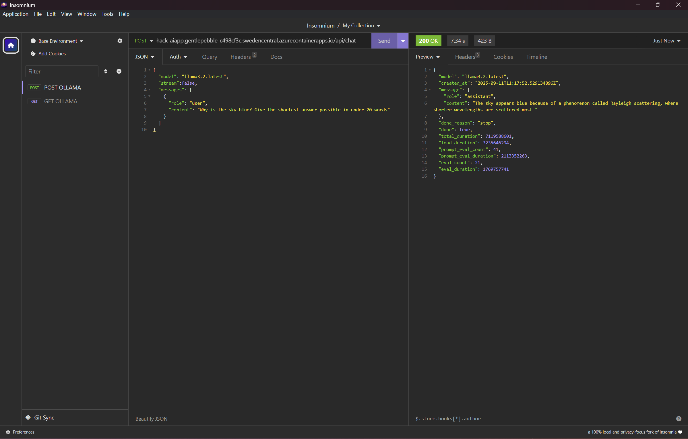
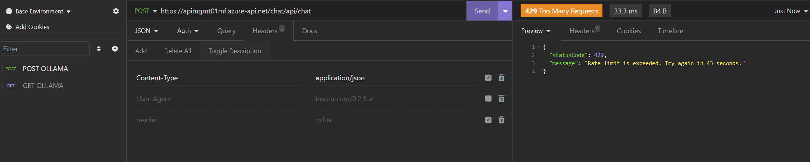

# Walkthrough Challenge 6 - Calling Ollama model with the API

Duration: 30 minutes

## Prerequisites

Please make sure thet you successfully completed [Challenge 5](../challenge-5/solution.md) before continuing with this challenge.

Please make sure you have one of those tools available: [Postman](https://www.postman.com/downloads/) or [insomnium](https://github.com/ArchGPT/insomnium)

### **Task 1: Change the AI container so it's accept the traffic from anywhere**

In the Azure Portal look for the Container App which is hosting an Ollama model. We have refered to it as `microhack-aiapp`. 

In the *Network* tab of the Container App, you need to look for `Ingress` configuration. 
You need to change the *Ingress Traffic* option from *Limited to Container App Enviroment* to *Accepting traffic from anywhere*.



Now the access to Ollama model can happen from any source.

### **Task 2: Test the Ollama model responses.**

Please open either the browser or one of the mentioned tools to generate a simple GET request to Ollama container.

To do that, you have to know the Ollama container ingress endpoint taken from Azure.

Then you may want to check the API of the Ollama local models by analyzing this one.

At first, we will get the list of all the models Ollama can offer by calling: 
```
https://<microhack-aiapp ingress URL>/api/tags
```

The call may look like this: 


The response you can see in the image above but also below:
```
{
	"models": [
		{
			"name": "llama3.2:latest",
			"model": "llama3.2:latest",
			"modified_at": "2025-09-10T10:47:33.272064887Z",
			"size": 2019393189,
			"digest": "a80c4f17acd55265feec403c7aef86be0c25983ab279d83f3bcd3abbcb5b8b72",
			"details": {
				"parent_model": "",
				"format": "gguf",
				"family": "llama",
				"families": [
					"llama"
				],
				"parameter_size": "3.2B",
				"quantization_level": "Q4_K_M"
			}
		}
	]
}
```

### **Task 3: Let's chat with the model through the API.**

So now, let's call the Ollama model to chat with it.

In the tools of your choice (I am using Insomnium in here), create a simple POST request to API:
```
https://<microhack-aiapp ingress URL/api/chat
```

JSON request body of the content like below:
```
{
  "model": "llama3.2:latest",
  "stream":false,
  "messages": [
    {
      "role": "user",
      "content": "Why is the sky blue? Give the shortest answer possible in under 20 words"
    }
  ]
}
```

The call will look like this: 



The answer you should see if the model is responding well will look like that:
```
{
	"model": "llama3.2:latest",
	"created_at": "2025-09-10T11:17:52.529134896Z",
	"message": {
		"role": "assistant",
		"content": "The sky appears blue because of a phenomenon called Rayleigh scattering, where shorter wavelengths are scattered most."
	},
	"done_reason": "stop",
	"done": true,
	"total_duration": 7119588601,
	"load_duration": 3235646294,
	"prompt_eval_count": 41,
	"prompt_eval_duration": 2113352263,
	"eval_count": 21,
	"eval_duration": 1769757741
}
```

### **Task 4: Let's chat with the model through the Azure API Management**

What you have done in the past three tasks was a simple but not scalaable at all, especially if you want to expose services at scale. To change that, let's add Azure API Management which will help you to rate limit the calls which are coming.

The challange is the following:
1. Spin up a Developer SKU of Azure API Management
2. Configure a simplt HTTP API to `microhack-aiapp` app
3. The, for the inboud set of policies use [Limit call rate by key](https://learn.microsoft.com/en-us/azure/api-management/rate-limit-by-key-policy) policy. You can use for that purpose a sample:
```
 <rate-limit-by-key calls="5"
              renewal-period="60"
              increment-condition="@(context.Response.StatusCode == 200)"
              counter-key="@(context.Request.IpAddress)"
              remaining-calls-variable-name="remainingCallsPerIP"/>
```
4. Then check by using Postman, Curl or other tool if you can see the limit being enforced.
Make sure you use the URL to your API Management rather than to your `microhack-aiapp` app


You successfully completed challenge 6! 🚀🚀🚀

 **[Home](../../Readme.md)**